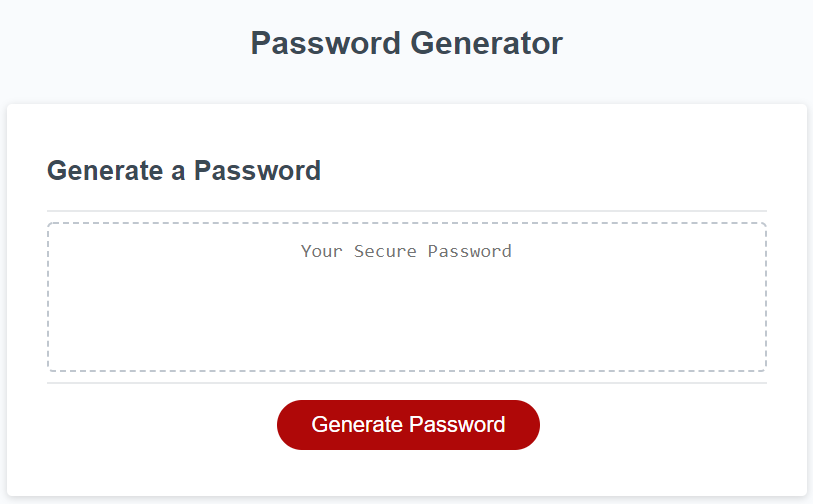
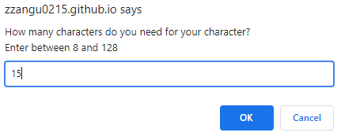
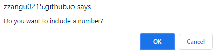
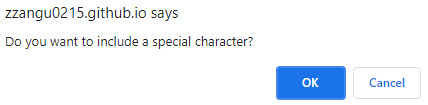
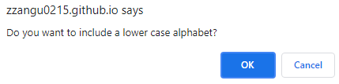
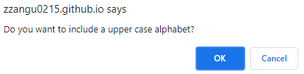
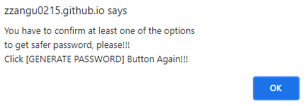
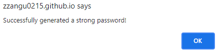
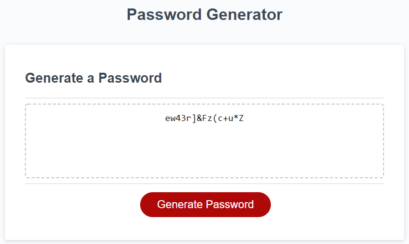

# Password Generator

If you are unsure what password you should use to keep your **personal information** safe on the browsers?  
I will let you use my strong **Password Generator**!

## Features

In my password generator, you would see some cool features!

1. You can start generating a password by clicking a red **Generate Password** button.

    

2. Once you clicked the button, it will prompt you to pick the length of the password.

    
    If you put a number is less than 8 or greater than 128, it will keep prompt you to enter the valid nubmer until you put the number in a range of **8~128**. 

3. Once the browser takes the valid length of the password, it will ask you to include a number. 

    

4. Next, it will ask you to include a special character.

    

5. Next, it will ask you to include a lower case alphabet.

    

6. Finally, it will ask you to include a upper case alphabet.

    

7. Oops! If you did not choose any of those criteria, it will alert you to choose at least one!

    

7. The password generator takes inputs from your choices, then generates the strongest password in the world!

    
    

## Demo Video

If you are unsure how my password generator works?  
Go to this link, and see the **DEMO VIDEO**!

**YOUTUBE LINK:** **https://youtu.be/ZGy8CVVFtc8**

## Author

- **Jun Park**
    - Portfolio: https://zzangu0215.github.io/BootCamp-Homework2/ (to be changed)
    - Email: tajo0215@gmail.com
    - SNS: https://www.instagram.com/o0ojunny/